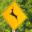

# **Traffic Sign Recognition** 

**Build a Traffic Sign Recognition Project**

The goals / steps of this project are the following:
* Load the data set (see below for links to the project data set)
* Explore, summarize and visualize the data set
* Design, train and test a model architecture
* Use the model to make predictions on new images
* Analyze the softmax probabilities of the new images
* Summarize the results with a written report

## Rubric Points
### Here I will consider the [rubric points](https://review.udacity.com/#!/rubrics/481/view) individually and describe how I addressed each point in my implementation.  

---
### Writeup / README

#### 1. Provide a Writeup / README that includes all the rubric points and how you addressed each one. You can submit your writeup as markdown or pdf. You can use this template as a guide for writing the report. The submission includes the project code.

You're reading it! All the code resides in the [iPython notebook](Traffic_Sign_Classifier.ipynb)

### Data Set Summary & Exploration

#### 1. Provide a basic summary of the data set. In the code, the analysis should be done using python, numpy and/or pandas methods rather than hardcoding results manually.

I used numpy library to calculate summary statistics of the traffic
signs data set:

* The size of training set is 34799
* The size of the validation set is 4410
* The size of test set is 12630
* The shape of a traffic sign image is 32 x 32
* The number of unique classes/labels in the data set is 43

#### 2. Include an exploratory visualization of the dataset.

I used numpy histogram to visualize the number of images of each class. From the histogram we can tell the distribution is very imbalanced.

### Design and Test a Model Architecture

#### 1. Describe how you preprocessed the image data. What techniques were chosen and why did you choose these techniques? Consider including images showing the output of each preprocessing technique. Pre-processing refers to techniques such as converting to grayscale, normalization, etc. (OPTIONAL: As described in the "Stand Out Suggestions" part of the rubric, if you generated additional data for training, describe why you decided to generate additional data, how you generated the data, and provide example images of the additional data. Then describe the characteristics of the augmented training set like number of images in the set, number of images for each class, etc.)

These are the steps I took to prepare the data
* Convert to gray scale: Converting the images from 3 channel to single channel image reduces the size so that increases learning speed. Also it maybe helpful in generalize images taken under different lighting condition
* Duplicate: Knowing the training set is unbalanced, I decide to duplicate the class that has less than 1000 samples to have at least 1000 samples.
* Normalization: Normalize the 8 bit gray scale image array to -1 ~ 1. 
* Rotate image (did not end up using): During the duplication, I use PIL library to rotate the image by a random degree between +/- 15 degrees. However, the rotating step added some black ribbon to the side. The learning must be picking up the ribbon as a indication for classification and significantly decreased the validation accuracy.
* Get more data (did not end up using): There are 12630 extra data available, known as the 'test' set, that is not being used in this project yet. Understanding that 'test' set is supposed to be reserved for the grand finale, I decided not to use it.

#### 2. Describe what your final model architecture looks like including model type, layers, layer sizes, connectivity, etc.) Consider including a diagram and/or table describing the final model.

My final model consisted of the following layers:

| Layer         		|     Description	        					| 
|:---------------------:|:---------------------------------------------:| 
| Input         		| 32x32x1 Gray image   							| 
| Convolution 5x5     	| 1x1 stride, valid padding, outputs 28x28x6 	|
| RELU					|												|
| Max pooling	      	| 2x2 stride,  outputs 14x14x6 				|
| Convolution 5x5	    | 1x1 stride, valid padding, outputs 10x10x16      									|
| RELU					|												|
| Max pooling	      	| 2x2 stride,  outputs 5x5x16 				|
| Flatten          | outputs 400  |
| Fully connected		| outputs 120        									|
| RELU					|												|
| Drop out					|												|
| Fully connected		| outputs 84        									|
| RELU					|												|
| Drop out					|												|
| Fully connected		| outputs 43 (classes) 									|

#### 3. Describe how you trained your model. The discussion can include the type of optimizer, the batch size, number of epochs and any hyperparameters such as learning rate.

To train the model, I used 'AdamOptimizer' to 'reduce_mean'.

I ran 20 epochs on the data with a batch size of 128.

Learning rate is set at 0.001.

Both drop out layer uses a keep rate of 70%

#### 4. Describe the approach taken for finding a solution and getting the validation set accuracy to be at least 0.93. Include in the discussion the results on the training, validation and test sets and where in the code these were calculated. Your approach may have been an iterative process, in which case, outline the steps you took to get to the final solution and why you chose those steps. Perhaps your solution involved an already well known implementation or architecture. In this case, discuss why you think the architecture is suitable for the current problem.

My final model achieved validation accuracy of 0.952.

I started with the LeNet for classifying numbers as my starting point.
In order to improve the model accuracy, I had to add drop out layers 
The final model achieved a good validation accuracy. With more training data, I believe it should perform better.
 

### Test a Model on New Images

#### 1. Choose five German traffic signs found on the web and provide them in the report. For each image, discuss what quality or qualities might be difficult to classify.

Instead, I went out and took several traffic signs with my phone and resized them to 32x32, wondering how good Germans are recognizing American traffic signs. 

I chose these 5 images and made sure they are each of a applicable classification from the training set (stop, yield, wild animals crossing, pedestrains, traffic signals) 

 

All images can be difficult to classify becasue they are mostly of a different shape comparing to the German traffic signs, even though the content of them convey same information.

#### 2. Discuss the model's predictions on these new traffic signs and compare the results to predicting on the test set. At a minimum, discuss what the predictions were, the accuracy on these new predictions, and compare the accuracy to the accuracy on the test set (OPTIONAL: Discuss the results in more detail as described in the "Stand Out Suggestions" part of the rubric).

Here are the results of the prediction:

| Image			        |     Prediction	        					| 
|:---------------------:|:---------------------------------------------:| 
| Stop      		| Speed limit (50km/h)   									| 
| Yield     			| Yield 										|
| Wild animals crossing					| Speed limit (50km/h)											|
| Pedestrians	      		| Speed limit (30km/h)					 				|
| Traffic signals			| Right-of-way at the next intersection      							|

The model was able to correctly guess 1 of the 5 traffic signs, which gives an accuracy of 20%.
This is no surprise to me for the reason described in last topic. The yield sign performed well becasue both German and American uses a up-side-down triangle for yield.

#### 3. Describe how certain the model is when predicting on each of the five new images by looking at the softmax probabilities for each prediction. Provide the top 5 softmax probabilities for each image along with the sign type of each probability. (OPTIONAL: as described in the "Stand Out Suggestions" part of the rubric, visualizations can also be provided such as bar charts)

Here are the top 5 probabilities for each image determined by the model.

Image of (Stop) classified as:

Speed limit (50km/h) : 0.806144

Priority road : 0.105460

Stop : 0.045420

Speed limit (60km/h) : 0.019392

Speed limit (30km/h) : 0.006571

Image of (Yield) classified as:

Yield : 0.615168

Keep right : 0.383962

Turn left ahead : 0.000747

Road work : 0.000059

Speed limit (50km/h) : 0.000032

Image of (Wild animals crossing) classified as:

Speed limit (50km/h) : 0.989132

Speed limit (30km/h) : 0.010867

Double curve : 0.000000

Road work : 0.000000

Speed limit (80km/h) : 0.000000

 

Image of (Pedestrians) classified as:

Speed limit (30km/h) : 0.999999

Pedestrians : 0.000000

Speed limit (20km/h) : 0.000000

Speed limit (50km/h) : 0.000000

Roundabout mandatory : 0.000000

Image of (Traffic signals) classified as:

Right-of-way at the next intersection : 0.900019

Beware of ice/snow : 0.081681

Roundabout mandatory : 0.017390

Traffic signals : 0.000811

Priority road : 0.000050

### (Optional) Visualizing the Neural Network (See Step 4 of the Ipython notebook for more details)
#### 1. Discuss the visual output of your trained network's feature maps. What characteristics did the neural network use to make classifications?

